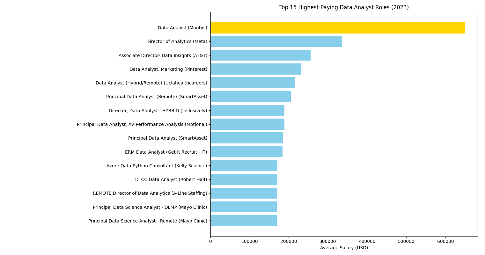

# Introduction
"📊 Focusing on data analyst roles, this project explores 💰 top-paying jobs, 🔥 in-demand skills, and 📈 where high demand meets high salary in data analytics."

From a personal perspective, this project was made with the intention of practicing and improving my SQL skills - The main goal was to learn, with a secondary goal to find out what skills I should be focusing on when jumping into the data analyst job market.

> 🔎 Check out the SQL queries here: [project_sql folder](/project_sql/)
# Background
Data and guidance on the project comes from [Luke Barousse's SQL Course](https://lukebarousse.com/sql), and this data was collected in 2023. All queries were created using the shell provided by Luke, modified to fit my needs. 

> 🔎 Additonal queries written while following the course: [sql_c1_queries](/sql_c1%20_queries/)

### Questions answered through these SQL queries:

1. What are the top-paying data analyst roles?
2. What skills are required for these top-paying jobs?
3. What skills are most in demand for data analysts?
4. Which skills are associated with higher salaries?
5. What are the most optimal skills to learn?

# Tools I Used
The following tools were used to create this project:

- **SQL:** Language used to query the database.
- **PostgreSQL:** DBMS chosen for the job posting data.
- **Visual Studio Code:** Software used for database management and executing SQL queries.
- **Git & GitHub:** For version control and sharing the SQL scripts and analysis.
# The Analysis
Each query for this project investigated specific aspects of the data analyst job market. Here is how each question was answered:

### 1. Top Paying Data Analyst Jobs
To identify the highest-paying roles, data analyst positions were filtered by average yearly salary and location, focusing on jobs available to someone living in Michigan such as myself (meaning remote or local positions). The 15 highest paying opportunities for this field were found.

```sql
SELECT
    job_id,
    job_title,
    job_location,
    job_schedule_type,
    salary_year_avg,
    name AS company_name,
    job_posted_date::DATE
FROM
    job_postings_fact
LEFT JOIN company_dim ON job_postings_fact.company_id = company_dim.company_id
WHERE
    job_title_short = 'Data Analyst' AND
    (job_location = 'Anywhere' OR job_location LIKE '%MI%') AND
    salary_year_avg IS NOT NULL
ORDER BY
    salary_year_avg DESC
LIMIT 15;
```

To summarize the top data analyst roles found from this query:

- **High End Salary Range:** Top 15 paying data analyst roles spanned from $650,000 to $169,000.
- **Diverse Employers:** Companies like Meta, AT&T, and Mayo Clinic were among these results, showing interest for this type of role across multiple industries.
- **Remote over Local:** Jobs listed as remote took up 13 of the 15 roles found, with the remaining two being in Michigan. This lines up with prior expectations.


*Bar graph visualizing salary for the top 15 results; Python code for this graph generated by ChatGPT using my SQL query results*

<!-- TODO: INCLUDE OTHER 4 QUERIES -->

# What I Learned

<!-- TODO: INCLUDE WHAT WAS LEARNED -->

# Conclusions

<!-- TODO: INCLUDE CONCLUSION -->