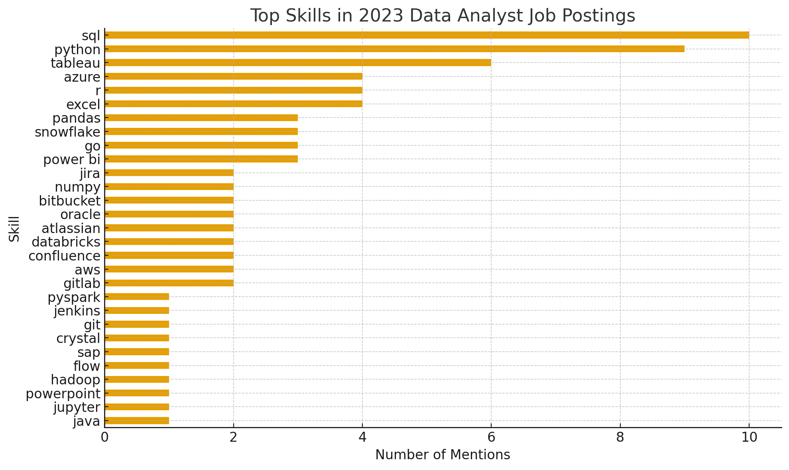

# Introduction
"📊 Focusing on data analyst roles, this project explores 💰 top-paying jobs, 🔥 in-demand skills, and 📈 where high demand meets high salary in data analytics."

From a personal perspective, this project was made with the intention of practicing and improving my SQL skills - The main goal was to learn, with a secondary goal to find out what skills I should be focusing on when jumping into the data analyst job market.

> 🔎 Check out the SQL queries here: [project_sql folder](/project_sql/)
# Background
Data and guidance on the project comes from [Luke Barousse's SQL Course](https://lukebarousse.com/sql), and this data was collected in 2023. All queries were created using the shell provided by Luke, modified to fit my needs. 

> 🔎 Additonal queries written while following the course: [sql_c1_queries](/sql_c1%20_queries/)

### Questions answered through these SQL queries:

1. What are the top-paying data analyst roles?
2. What skills are required for these top-paying jobs?
3. What skills are most in demand for data analysts?
4. Which skills are associated with higher salaries?
5. What are the most optimal skills to learn?

# Tools I Used
The following tools were used to create this project:

- **SQL:** Language used to query the database.
- **PostgreSQL:** DBMS chosen for the job posting data.
- **Visual Studio Code:** Software used for database management and executing SQL queries.
- **Git & GitHub:** For version control and sharing the SQL scripts and analysis.
# The Analysis
Each query for this project investigated specific aspects of the data analyst job market. Here is how each question was answered:

### 1. Top Paying Data Analyst Jobs
To identify the highest-paying roles, data analyst positions were filtered by average yearly salary and location, focusing on jobs available to someone living in Michigan such as myself (meaning remote or local positions). The 15 highest paying opportunities for this field were found.

```sql
SELECT
    job_id,
    job_title,
    job_location,
    job_schedule_type,
    salary_year_avg,
    name AS company_name,
    job_posted_date::DATE
FROM
    job_postings_fact
LEFT JOIN company_dim ON job_postings_fact.company_id = company_dim.company_id
WHERE
    job_title_short = 'Data Analyst' AND
    (job_location = 'Anywhere' OR job_location LIKE '%MI%') AND
    salary_year_avg IS NOT NULL
ORDER BY
    salary_year_avg DESC
LIMIT 15;
```

Here is a breakdown of the top data analyst roles found from this query:

- **High End Salary Range:** Top 15 paying data analyst roles spanned from $650,000 to $169,000.
- **Diverse Employers:** Companies like Meta, AT&T, and Mayo Clinic were among these results, showing interest for this type of role across multiple industries.
- **Remote over Local:** Jobs listed as remote took up 13 of the 15 roles found, with the remaining two being in Michigan. This lines up with prior expectations.


*Bar graph visualizing salary for the top 15 results; Python code for this graph generated by ChatGPT using my SQL query results*

### 2. Skills for the Top Paying Jobs
To see what skills were sought after at high-paying positions, all skills listed for each of the top 15 job postings were found and listed by referencing our first query as a CTE and joining the tables with job postings and skills respectively.

```sql
WITH top_paying_jobs AS (
    SELECT
        job_id,
        job_title,
        salary_year_avg,
        name AS company_name
    FROM
        job_postings_fact
    LEFT JOIN company_dim ON job_postings_fact.company_id = company_dim.company_id
    WHERE
        job_title_short = 'Data Analyst' AND
        (job_location = 'Anywhere' OR job_location LIKE '%MI%') AND
        salary_year_avg IS NOT NULL
    ORDER BY
        salary_year_avg DESC
    LIMIT 15
)

SELECT
    top_paying_jobs.*,
    skills
FROM top_paying_jobs
INNER JOIN skills_job_dim ON top_paying_jobs.job_id = skills_job_dim.job_id
INNER JOIN skills_dim ON skills_job_dim.skill_id = skills_dim.skill_id
ORDER BY
    salary_year_avg DESC;
```

Here is a breakdown of the most demanded skills from these 15 job postings:
- **SQL:** The leading skill, mentioned 10 times in job postings.
- **Python:** Mentioned 9 times.
- **Tableau:** Mentioned 6 times.
- Other skills such as **Azure**, **R**, **Excel**, **Pandas**, **Snowflake**, **Go**, **Power BI** – Each appears with varying degrees of demand.


*Bar graph visualizing the frequency of skill requirements in the top 15 highest-paying data analyst roles; Graph generated by ChatGPT using my SQL query results*

### 3. Top Demanded Skills
Next, to see what skills were in demand across all job listings meeting the criteria of being based in Michigan or remote, an aggregate count of the top 5 most demanded skills were collected.

```sql
SELECT
    skills,
    COUNT(skills_job_dim.job_id) AS demand_count
FROM job_postings_fact
INNER JOIN skills_job_dim ON job_postings_fact.job_id = skills_job_dim.job_id
INNER JOIN skills_dim ON skills_job_dim.skill_id = skills_dim.skill_id
WHERE
    job_title_short = 'Data Analyst' AND
    (job_work_from_home = true OR job_location LIKE '%MI%')
GROUP BY
    skills
ORDER BY
    demand_count DESC
LIMIT 5;
```

Here is a breakdown of the 5 most demanded skills across all job postings:
- **SQL and Excel** were the two most demanded skills due to their usefulness is data processing and manipulation.
- **Python** was the next most demanded skill, showing a desire for technical skills.
- **Tableau and Power BI** followed shortly behind, thanks to the importance of data storytelling and visualization.

| Skill    | Demand Count |
|---------|-------------|
| SQL     | 7,350 |
| Excel   | 4,656 |
| Python  | 4,362 |
| Tableau | 3,774 |
| Power BI| 2,643 |

*Table of the demand for the top 5 skills in data analyst job postings*

### 4. Top Paying Skills
Finding how average salaries correlated with the demanding skills revealed which skills are the highest paying.
```sql
SELECT
    skills,
    ROUND(AVG(salary_year_avg), 0) AS avg_salary
FROM job_postings_fact
INNER JOIN skills_job_dim ON job_postings_fact.job_id = skills_job_dim.job_id
INNER JOIN skills_dim ON skills_job_dim.skill_id = skills_dim.skill_id
WHERE
    job_title_short = 'Data Analyst' 
    AND salary_year_avg IS NOT NULL
    AND (job_work_from_home = true OR job_location LIKE '%MI%')
GROUP BY
    skills
ORDER BY
    avg_salary DESC
LIMIT 25;
```

Here's a breakdown of the results for top paying skills:
- Big Data: Tools like PySpark and Databricks top the salary list, showing strong demand for large-scale data processing skills.
- DevOps & ML: Bitbucket, GitLab, Watson, and DataRobot highlight higher pay for analysts bridging analytics, machine learning, and production systems.
- Cloud & Code Flexibility: Skills like Kubernetes, Airflow, GCP, and coding in Go/Scala/Swift earn a bonus for enabling pipeline automation and cloud-native workflows.

| Skill         | Average Salary (USD) |
|--------------|---------------------|
| PySpark      | 208,172 |
| Bitbucket    | 189,155 |
| Couchbase    | 160,515 |
| Watson       | 160,515 |
| DataRobot    | 155,486 |
| GitLab       | 154,500 |
| Swift        | 153,750 |
| Jupyter      | 152,777 |
| Pandas       | 151,821 |
| Elasticsearch| 145,000 |

*Table displaying the top 10 highest paying skills on average*

### 5. Optimal Skills to Learn
By analyzing the frequency of top demanded skills across all job postings and combining those insights with the highest paying skills, the most "optimal" skills for an aspiring data analyst to learn were extracted.

```sql
SELECT
    skills_dim.skill_id,
    skills_dim.skills,
    COUNT(skills_job_dim.job_id) AS demand_count,
    ROUND(AVG(job_postings_fact.salary_year_avg), 0) AS avg_salary
FROM job_postings_fact
INNER JOIN skills_job_dim ON job_postings_fact.job_id = skills_job_dim.job_id
INNER JOIN skills_dim ON skills_job_dim.skill_id = skills_dim.skill_id
WHERE
    job_title_short = 'Data Analyst'
    AND salary_year_avg IS NOT NULL
    AND (job_work_from_home = true OR job_location LIKE '%MI%')
    AND skills_dim.skill_id <> '7' -- Catches duplicate skill 'sas' in skills table
GROUP BY
    skills_dim.skill_id
HAVING
    COUNT(skills_job_dim.job_id) > 10
ORDER BY
    avg_salary DESC,
    demand_count DESC
LIMIT 25;
```

Here is a breakdown of the most optimal skills:
- **High-Demand + Solid Salary Skills:** Python (237 postings, $101,601 avg), Tableau (230 postings, $99,288 avg), R (148 postings, $100,499 avg), and Power BI (110 postings, $97,431 avg) dominate demand, making them the safest and most broadly applicable choices for data analysts seeking marketable skills.
- **Cloud & Data Engineering Skills:** Snowflake (37 postings, $112,948), AWS (32 postings, $108,317), Azure (34 postings, $111,225), and BigQuery (13 postings, $109,654) show stronger salaries paired with decent demand, signaling that cloud-based data engineering expertise is a high-value avenue.
- **Specialty Tools & Advanced Analytic Skills:** Skills like Go ($115,320), Hadoop ($113,193), and Looker (49 postings, $103,795) aren’t as widely requested but command above-average salaries.

| Skill       | Demand Count | Average Salary (USD) |
|------------|-------------|---------------------|
| Go         | 27          | 115,320 |
| Confluence | 11          | 114,210 |
| Hadoop     | 22          | 113,193 |
| Snowflake  | 37          | 112,948 |
| Azure      | 34          | 111,225 |
| BigQuery   | 13          | 109,654 |
| AWS        | 32          | 108,317 |
| Java       | 17          | 106,906 |
| SSIS       | 12          | 106,683 |
| Jira       | 20          | 104,918 |

*Table displaying top 10 optimal skills - Note that the more demanded skills appeared later in the list due to their lower average salary*

# What I Learned

Through analyzing data analyst job listings from 2023, I learned many important skills relating to SQL as well as some guidance on what skills I should be focused on going forward:

- **Complex Queries:** I learned many advanced SQL techniques, allowing me to perform operations such as merging tables through the use of joins and CTEs in order to connect the data to my insights.
- **Data Aggregation:** I got more comfortable with the GROUP BY statement, allowing for aggregate functions such as COUNT() and AVG() to help perform operations on the data.
- **Analysis and Problem Solving:** I was able to combine all of these skills to perform the analysis needed for each question I aimed to answer, resulting in practical queries and insight into the job market.
- **Skills to Learn:** From this data, it's clear that Python, Tableau/Power BI, and R are safe bets for what to utilize in future projects to further develop my skills.

# Conclusions

### Insights
Several general insights were gained from the analysis of remote and local data analysis job postings:

1. **Top-Paying Data Analyst Jobs:** The top 15 highest paying Data Analysis jobs meeting my criteria had a wide range of salaries all above $169,000, from companies spanning multiple different fields and the majority of these listings being remote as opposed to being based in Michigan.
2. **Skills for Top-Paying Jobs:** The skills for these jobs mentioned SQL, Python, and Tableau the most, hinting at these skills being critical skills for a Data Analyst to know.
3. **Top-Demanded Skills:** Further analysis across all job listings further proved that SQL is the most demanded skill, making it essential to know.
4. **Top-Paying Skills:** Specialized skills such as DataRobot and Go, were associated with higher salaries on average.
5. **Optimal Skills:** Alongside SQL, skills like Python and Tableau showed to have both high demand and higher average salary counts, marking them as optimal skills for data analysts to learn to maximize their market value.

### Closing Thoughts

This project helped build up and refresh my SQL skills while providing insights into the job market I am aiming to enter. Not only will I use the information gained from my analysis to help influence future projects and decisions going forward, I also am much more comfortable performing queries on data with the intention of finding answers to a question or problem. I hope to continue utilizing these skills and grow accustomed to more of the popular tools amongst data analysts.

<!-- TODO: INCLUDE CONCLUSION -->